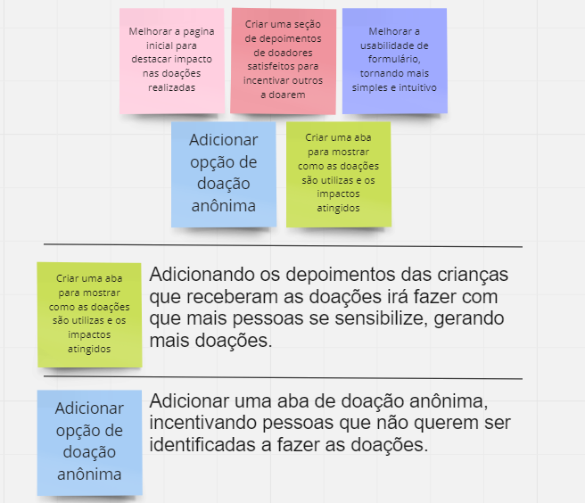

# Informações do Projeto
`TÍTULO DO PROJETO`  

Doação para o público infantil. 

`CURSO` 

Analise e Desenvolvimento de Sistemas.

## Participantes

- Armintas Fernandes da Silva Filho.
- Arthur Trindade.
- João Lucas.
- Marcos Paulo.
- Matheus Roberto Almeida Sacramento. 

# Estrutura do Documento
- [Informações do Projeto](#informações-do-projeto)
  - [Participantes](#participantes)   
- [Estrutura do Documento](#estrutura-do-documento)  
- [Design Thinking](#design-thinking)
  - [Matriz CSD](#matriz-csd)
  - [Mapa de StakeHolders](#mapa-de-stakeholders)
  - [Diagrama de Personas](#diagrama-de-personas)
  - [Mural de possibilidades](#mural-de-possibilidades)
  - [Mapa de priorização](#mapa-de-priorização)

# Design Thinking 
O Design Thinking é um método para estimular ideação e perspicácia ao abordar problemas, relacionados a futuras aquisições de informações, análise de conhecimento e propostas de soluções. 
Dentro dos artefatos do Design Thinking podemos listar: 
- Matriz CSD.
- Mapa de StakeHolders.
- Diagrama de Personas.
- Mural de Possibilidades. 
- Mapa de Priorização

## Matriz CSD
Nesta parte fizemos uma tabela composta por 3 colunas divididas em Certezas, Suposições e Duvidas que o grupo tem sobre o projeto.

## Mapa de StakeHolders
Nesta parte fizemos a representação das pessoas, orgãos e organizações que apresentam algum nível de interesse com o nosso projeto. Entre elas listamos: 
- **Pais e Responsáveis:** Os pais ou responsáveis pelas crianças também podem ser stakeholders importantes, já que são responsáveis pela tomada de decisão sobre o bem-estar das crianças. Eles podem estar envolvidos na escolha de organizações de caridade para doar e podem fornecer feedback sobre a eficácia das doações.
- **Governo e Reguladores:** O governo pode ser considerado um stakeholder, já que pode ter políticas ou leis que afetam as organizações de caridade ou as doações para o público infantil.
- **Doadores Individuais:** Doadores individuais que contribuem para as doações para o público infantil são outra parte interessada importante. Eles podem ter motivos diferentes para doar e podem ter opiniões diferentes sobre as organizações de caridade que escolhem.
- **Comunidade Local:** A comunidade local onde a organização beneficiária do site de doações está localizada, que pode ter interesse e envolvimento na causa apoiada e no impacto gerado pelas doações.
- **Organizações Beneficiárias (ONG's):** Organizações sem fins lucrativos ou instituições de caridade que serão beneficiadas pelas doações feitas por meio do site. Podem ter requisitos específicos em relação às doações recebidas, prestação de contas e relatórios.
- **Equipe Interna:** Membros da equipe interna responsável pela gestão e operação do site de doações, incluindo desenvolvedores, designers, gerentes de projeto, profissionais de marketing, atendimento ao cliente, entre outros.
- **Mídia e Opinião Pública:** Mídia local, regional ou nacional, bem como influenciadores online e personalidades relevantes que possam promover o site de doações e aumentar sua visibilidade junto ao público.
- **Empresas e Patrocinadores:**  Empresas ou organizações que podem fornecer recursos financeiros, parcerias estratégicas ou patrocínios para apoiar o site de doações, em troca de exposição ou benefícios corporativos.

## Diagrama de Personas

## Mural de Possibilidades
Nesta parte listamos diferentes ideias em um quadro e dentre elas escolhemos as duas melhores para detalharmos.

## Mapa de priorização
Nesta parte representamos o nível de importancia e o nível de urgência em relação aos nosso requisitos.

