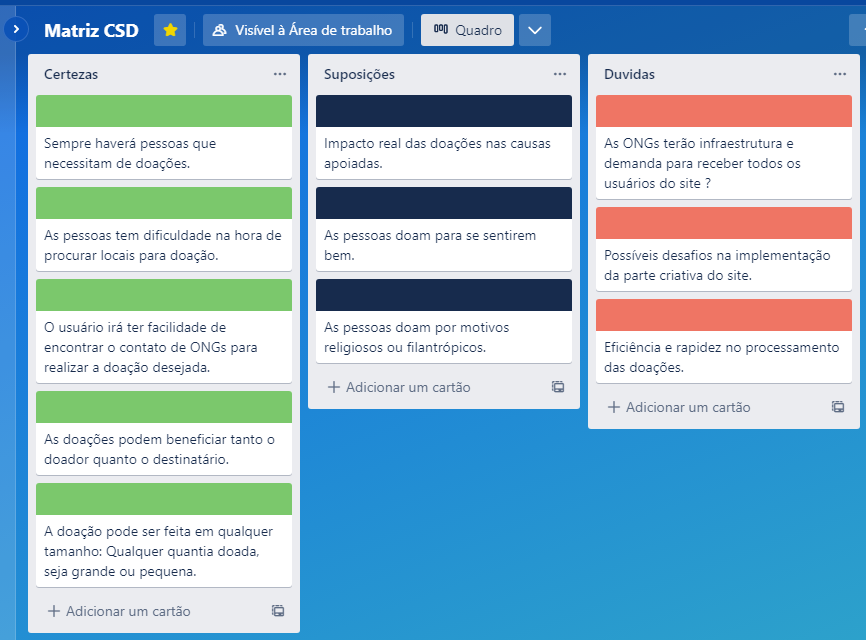
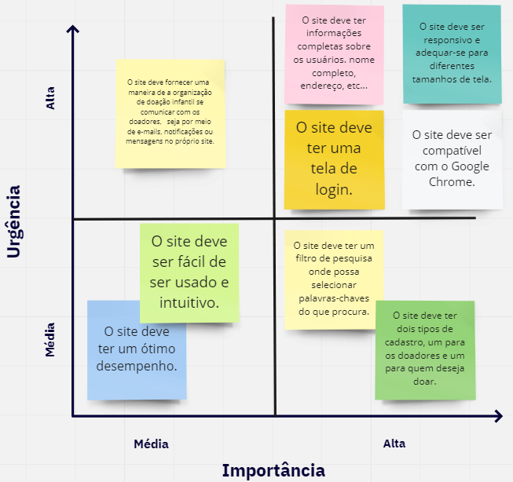

# Informações do Projeto
`TÍTULO DO PROJETO`  

Doação para o público infantil. 

`CURSO` 

Analise e Desenvolvimento de Sistemas.

## Participantes

- Armintas Fernandes da Silva Filho.
- Arthur Trindade.
- João Lucas.
- Marcos Paulo.
- Matheus Roberto Almeida Sacramento. 

# Estrutura do Documento
- [Informações do Projeto](#informações-do-projeto)
  - [Participantes](#participantes)   
- [Estrutura do Documento](#estrutura-do-documento)  
- [Design Thinking](#design-thinking)
- [Mapa de StakeHolders](#mapa-de-stakeholders)
- [Diagrama de Personas](#diagrama-de-personas)
- [Mural de possibilidades](#mural-de-possibilidades)
- [Mapa de priorização](#mapa-de-priorização)

# Design Thinking 
Nesta parte fizemos a Matriz CSD, que é uma tabela composta por 3 colunas divididas em Certezas, Suposições e Duvidas sobre o projeto.

# Mapa de StakeHolders
Nesta parte fizemos a representação das pessoas, orgãos e organizações que apresentam algum nível de interesse com o nosso projeto. 

# Diagrama de Personas

# Mural de Possibilidades

# Mapa de priorização
