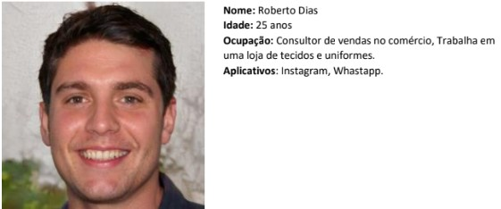
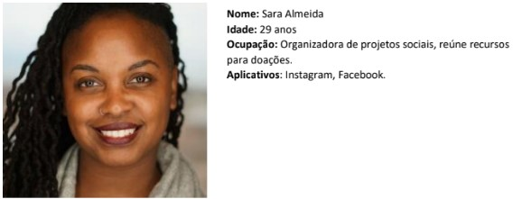
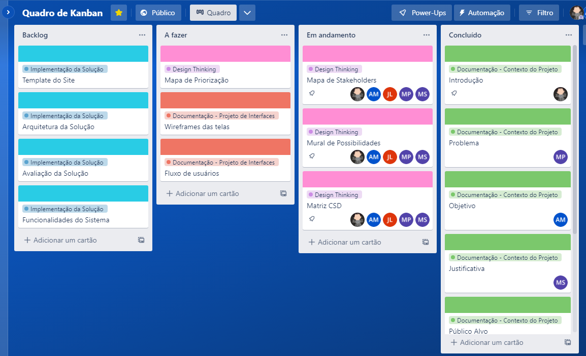

# Informações do Projeto
`TÍTULO DO PROJETO`  

Doação para o público infantil. 

`CURSO` 

Analise e Desenvolvimento de Sistemas.

## Participantes

- Armintas Fernandes da Silva Filho.
- Arthur Trindade.
- João Lucas.
- Marcos Paulo.
- Matheus Roberto Almeida Sacramento. 

# Estrutura do Documento

- [Informações do Projeto](#informações-do-projeto)
  - [Participantes](#participantes)
- [Estrutura do Documento](#estrutura-do-documento)
- [Introdução](#introdução)
  - [Problema](#problema)
  - [Objetivos](#objetivos)
  - [Justificativa](#justificativa)
  - [Público-Alvo](#público-alvo)
- [Especificações do Projeto](#especificações-do-projeto)
  - [Personas](#personas)
  - [Requisitos](#requisitos)
- [Metodologia](#metodologia)
  - [Relação de Ambientes de Trabalho](#relação-de-ambientes-de-trabalho)
  - [Gerenciamento da Equipe](#gerenciamento-da-equipe )
- [Projeto de Interface](#projeto-de-interface)
  - [Wireframes](#wireframes)
  - [Fluxo de Usuário](#fluxo-de-usuário)
- [Conclusões](#conclusões)
  
# Introdução
A cada dia que passa a desigualdade social vem crescendo no mundo e
infelizmente não são todas as pessoas que têm condições financeiras para viver no
“luxo”. E o fato de ter um filho, aumenta ainda mais os gastos no final do mês.

Consoante a isso, a doação infantil se torna crucial, pois ela fornece assistência
financeira a uma criança carente. As doações normalmente vão para educação,
saúde, nutrição e entre outras necessidades básicas.

No geral, os programas de doação ao público infantil podem ser uma maneira
poderosa de fazer a diferença no mundo e ajudar a melhorar a vida de crianças que
enfrentam desafios significativos.
## Problema

Muitas famílias hoje sofrem com problemas, como: 
- O desemprego.
- Saúde.
- Desigualdade social. 
- Educação, violência. 
- Exclusão social 
- O acesso a moradia com as devidas condições de infraestrutura. 

Esses problemas acabam dificultando várias famílias de terem condições
suficientes para criarem seus filhos e ficam dependente de muita ajuda social através
de doações de roupas, alimentos, entre outros.

Conforme o exposto, o problema que se busca resolver com esse projeto é de
ajudar as pessoas necessitadas, principalmente famílias com crianças.

## Objetivos

Nosso objetivo é fazer a ligação de pessoas que querem doar com os
meios de doação, como:
- Ongs. 
- Escolas infantis. 
- Creches. 
- Entre outros espaços. 

Por meio da ultilização do nosso site, facilitando assim, a comunicação entre os doadores e os que precisam de doações com a principal finalidade de ajudar uma criança carente.

## Justificativa
"No brasil, ao menos 32 milhões de meninos e meninas (63% do total) vivem na
pobreza, nas suas múltiplas dimensões. renda, educação, trabalho infantil, moradia,
água, saneamento e informação."
É o que indica a pesquisa “as múltiplas dimensões da pobreza na infância e na adolescência no brasil”. O estudo apresenta dados até 2019 (trabalho infantil), até 2020 (moradia, água, saneamento e informação), até 2021(renda, incluindo renda pra alimentação) e dados até 2022 (educação).

Assim concluindo-se a importância sobre o trabalho de ongs e pessoas
independentes, pelas quais se unem com um único objetivo, que é arrecadar fundos e
doações para o mesmo público citado acima, assim fomentando o surgimento de
vários sites para facilitar os meios de doações que as pessoas desejam fazer. Visto
que a situação atual no país é alarmante, com grandes números que só tendem a
crescer mais e mais com o passar dos anos.

## Público-Alvo
O foco deste trabalho está em todas as pessoas, como: 
- Pais. 
- Responsáveis.
- Educadores que tem como intuito ajudar o próximo e contribuir para causas sociais.
- Projetos que fazem movimentos frequentes de reunir materiais, roupas e comida para ongs e orfanatos.

# Especificações do Projeto
Nesta parte da documentação criamos 3 personas que representarão os possíveis usuários que utilizarão o nosso site. Juntamente com a criação das personas fizemos os requisitos do nosso site.  

## Personas
**1° Persona**

**2° Persona**

**3° Persona**

## Requisitos

As tabelas a seguir apresentam os requisitos funcionais, não funcionais e as restrições do projeto. 

### Requisitos Funcionais

|   ID  |                                     Descrição do Requisito                                         | Prioridade |
|-------|----------------------------------------------------------------------------------------------------|------------|
|RF-001 | O site deve ter um filtro de pesquisa onde possa selecionar  palavras-chaves do que procura.       |    MÉDIA   | 
|RF-002 | O site deve ter informações completas sobre os usuários.                                           |    ALTA    |
|RF-003 | O site deve ter uma tela de login.                                                                 |    ALTA    |
|RF-004 | O site deve fornecer uma maneira de a organização de doação infantil se comunicar com os doadores. |    ALTA    |

### Requisitos não funcionais
|   ID  |                                     Descrição do Requisito                                         | Prioridade |
|-------|----------------------------------------------------------------------------------------------------|------------|
|RNF-001| O site deve ter um ótimo desempenho.                                                               |    MÉDIA   | 
|RNF-002| O site deve ser responsivo e adequar-se para diferentes tamanhos de tela.                          |    ALTA    |
|RNF-003| O site deve ser fácil de ser usado e intuitivo.                                                    |    ALTA    |
|RNF-004| O site deve ser compatível com o Google Chrome.                                                    |    ALTA    |
|RNF-005| O site deve ter medidas de segurança para proteger as informações dos doadores.                    |    ALTA    |

### Restrições
|   ID  |                                     Descrição da Restrição                                                      |
|-------|-----------------------------------------------------------------------------------------------------------------|
|RES-001| A equipe não pode terceirizar o desenvolvimento do projeto.                                                     | 
|RES-002| O projeto deve ser entregue até o final do semestre letivo.                                                     |

# Metodologia
Nesta parte da documentação criamos uma tabela onde mostra o local onde a documentação, repositório, projeto de inteface, wireframe e gerenciamento do projeto esttá alocada. Juntamente com a tabela mostramos como a equipe está organizada.      

## Relação de Ambientes de Trabalho 
|             Ambiente             |  Plataforma |                                                         Link de Acesso                                                                  |
|----------------------------------|-------------|-----------------------------------------------------------------------------------------------------------------------------------------|
|Documentação                      |    GitHub   | https://github.com/TIAW2023/projetotiaw-doacao-para-o-publico-infantil/blob/master/docs/relatorio/Relatorio%20Tecnico%20-%20TEMPLATE.md | 
|Repositório de código fonte       |    GitHub   | link                                                                                                                                    |
|Projeto de interface & Wireframes |    GitHub   | link                                                                                                                                    |
|Gerenciamento do Projeto          |    Trello   | https://trello.com/b/wrN9ZYIs/quadro-de-kanban                                                                                          |

## Gerenciamento da Equipe 
A equipe utiliza o Scrum como base para definição do processo de desenvolvimento.

A equipe está organizada da seguinte forma:

- Scrum Master: Armintas Fernandes.
- Product Owner: Arthur Trindade.
- Equipe de Desenvolvimento:
  - Marcos Paulo (Desenvolvedor Full-Stack)
  - João Lucas (Desenvolvedor Full-Stack)
  - Matheus Roberto (Desenvolvedor Full-Stack)
 
Para organização e distribuição das tarefas do projeto, a equipe está utilizando
o Trello estruturado com as seguintes listas:

- **Backlog:** o backlog é uma lista de itens pendentes ou não concluídos que
precisam ser trabalhados, seja em desenvolvimento de software,
atendimento ao cliente, gestão de projetos ou em outros contextos
similares. É uma ferramenta de gerenciamento usada para priorizar e
acompanhar o progresso das tarefas pendentes.
- **A fazer:** Esta lista representa o Sprint Backlog. Este é o Sprint atual que
estamos trabalhando.
- **Em andamento:** Quando uma tarefa tiver sido iniciada, ela é movida para
cá.
- **Concluído:** Nesta lista são colocadas as tarefas já concluídas.

### Quadro de Kanban - Trello

# Projeto de Interface
Para fazer os wireframes e o fluxo de usuário nosso grupo optou por utilizar o site **mockflow.com**

## Wireframes

......  INCLUA AQUI OS WIREFRAMES DAS TELAS DA APLICAÇÃO COM UM BREVE DESCRITIVO ......

> Wireframes são protótipos das telas da aplicação usados em design de interface para sugerir a
> estrutura de um site web e seu relacionamentos entre suas
> páginas. Um wireframe web é uma ilustração semelhante ao
> layout de elementos fundamentais na interface.
> 
> **Links Úteis**:
> - [Ferramentas de Wireframes](https://rockcontent.com/blog/wireframes/)
> - [Figma](https://www.figma.com/)
> - [Adobe XD](https://www.adobe.com/br/products/xd.html#scroll)
> - [MarvelApp](https://marvelapp.com/developers/documentation/tutorials/)
> 
> **Exemplo**:
> 
> 

## Mapa de navegação

......  COLOQUE AQUI O SEU TEXTO OU DIAGRAMA DE NAVEGAÇÃO .......

> Inclua uma descrição textual ou um diagrama mostrando, sequencialmente, quais ações
> um usuário deve realizar para utilizar todas as características do seu sistema. 

> **Exemplo de Diagrama (opcional, pode ser em texto)**
> 

# Conclusões

......  COLOQUE AQUI O SEU TEXTO ......

> Finalize escrevendo um ou dois parágrafos para relembrar o objetivo do projeto, 
> o que foi possível alcançar e o que ficou para um trabalho futuro, e relembrando
> as principais dificuldes encontradas e como foi possível contorná-las. 

